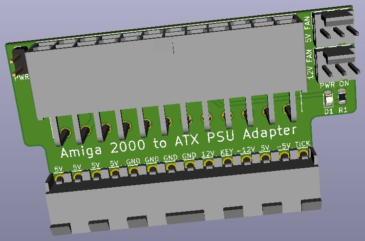

# A2000 ATX PSU Adapter
A power supply adapter for the Amiga 2000 to use an ATX power supply -- also provides -5VDC, 5V & 12V fan headers.

\

## Assembly
* Order the board from your PCB fabricator of choice. (JLCPCB, PCBway, OSH Park, etc.)
* Order the parts per the BOM. (Mouser, Digikey, RS, etc.)
* Solder the D1 and R1 first. (optional, for ATX "power good" signal indication)
* Solder C1 and C2 capacitors.
* Install U1 through the board, bend over the leads, flush clip them, then solder.
* Solder J1, then J2.
* Solder the power switch pin header and the fan headers.

## Installation
* Install an ATX power supply in your Amiga 2000. This step is not covered here, as there are many tutorials online already. Do not cut the 20-pin/24-pin connector.
* Set motherboard jumper U300 for using the Vsync generated TICK signal.
* Plug the A2000 ATX PSU Adapter into the motherboard's power connector.
* Plug in a toggle switch or latching switch to the 2-pin PWRSW pin header. The button can be mounted anywhere you run the wires to, or you can also use the original power supply's rocker switch to keep the OEM look and feel.
* Connect your ATX power supply 20-pin/24-pin connector to your newly built power adapter.
* Optional: The board provides 5V and 12V fan headers to cool anything you want. For example, the 5V fan header is good for a Raspberry Pi fan for the PiSTORM.

## Notes
* The 7905 voltage regulator takes power from the -12VDC ATX power supply and converts it to -5VDC for the Amiga.
* This ATX power supply adapter will probably be a little difficult to remove since it is a 14-pin connector with high friction. Be careful if you remove it. I designed it with the edges protruding a little so you have something to grip. Insertion/removal may be easier if the ATX power supply is already connected since you'll have additional plastic to grab onto.

## Misc
This design is open source. Feel free to do what you want with it.
